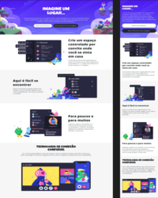

# 🏠 Construindo um Layout Responsivo Para o Site do Discord Com CSS

## 🧠 Entendendo o Desafio 

Neste Desafio foi reproduzido a página da incrível plataforma do Discord colocando em prática todos os conceitos aprendidos sobre Responsividade no CSS.

Seja criativo(a) e dê a sua identidade para o Projeto. Lembre-se que para um(a) Profissional de Tecnologia é super importante ter um portfólio sólido e completo. 🚀 

> **Colaboração:** NA
>
> **Status:**  Concluído  ✔️

## 👀 Prévia

## Link do Figma

Aqui deixamos o link do Protótipo no Figma apresentado durante o Desafio para que você o tenha como referência:

🔗 <a style="color: aqua" href="https://www.figma.com/design/NRBYrG5d4DSzObv7dpTqoM/Desafio-Responsividade---DIO?node-id=0-1&t=11mVTau64vWgsZmU-0">Desafio de Responsividade!</a> 

## Índice

- [Descrição](#descrição)
- [Conceitos Aprendidos](#conceitos-aprendidos)
- [Tecnologias Utilizadas](#tecnologias-utilizadas)
- [Instalação](#instalação)
- [Uso](#uso)
- [Contribuição](#contribuição)
- [Licença](#licença)
- [Recursos Adicionais](#recursos-adicionais)

## Descrição

Este projeto prático foi criado para entender e aplicar conceitos de CSS. A ideia é replicar ou melhorar o projeto original, criando um repositório próprio e aumentando meu portfólio de projetos no GitHub.

## Conceitos Aprendidos

- **Posicionamentos e Exibição de Elementos com CSS**

- **Trabalhando com Flexbox no CSS**

- **Dominando Grid Layouts no CSS**

- **Responsividade no CSS**

- **Desafio de Projeto: Construindo um Layout Responsivo Para o Site do Discord Com CSS**

## Tecnologias Utilizadas

- HTML
- CSS
- JavaScript (Foi utilizado mas é opcional)
- <a style="color: aqua" href="https://www.figma.com">Figma</a> 🔗

## Instalação
Para começar a usar este projeto, siga as etapas abaixo:

1. Clone o repositório:
<pre>git clone https://github.com/IgoRenatoo/HTCS-DIO-CloneDiscord</pre>

2. Acesse o diretório do projeto:
<pre>cd HTCS-DIO-CloneDiscord</pre>

3. Execute o projeto:
<pre>code .</pre>

4. Abra o arquivo index.html em seu navegador preferido.

[⬆️](#índice)

## Uso
Para visualizar o projeto, abra o arquivo index.html em seu navegador. Certifique-se de que todos os arquivos CSS e JavaScript estejam no diretório correto para garantir que o projeto funcione como esperado.

[⬆️](#índice)

## Contribuição
Contribuições são bem-vindas! Se você deseja contribuir com este projeto, siga as etapas abaixo:

1. Faça um fork deste repositório.
1. Crie uma branch para sua feature ou correção de bug ( `git checkout -b <nome-da-nova-ramificacao>` ).
1. Commit suas alterações ( `git commit -m 'Mensagem desejada'` ).
1. Push para a branch ( `git push origin <nome-da-branch-criada>` ).
1. Abra um Pull Request.

[⬆️](#índice)

## Licença
Este projeto está licenciado sob a Licença MIT.

Repositório Original no GitHub ~> 🔗 <a style="color: aqua" href="https://github.com/digitalinnovationone/trilha-css-desafio-01">Click Aqui!</a>

🔍 Se você encontrar um bug, parabéns! Você acabou de se tornar o testador oficial. 🎉
 
[⬆️](#índice)