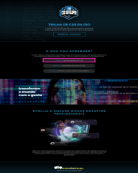

# Criando Landing Page com HTML e CSS

## 💻 Descrição do projeto

Este projeto prático foi desenvolvido para auxiliar desenvolvedores a compreender e aplicar conceitos de CSS abordados durante a imersão da Digital Innovation One. O objetivo é que você recrie o projeto original em seu próprio repositório, ampliando assim o seu portfólio no GitHub.

> **Colaboração:** Not found  
> **Status:**  Concluído  ✔️

  
 👀 Prévia 

  

## 📜 Índice

- [Descrição](#-descrição-do-projeto)
- [Conceitos Aprendidos](#-conceitos-aprendidos)
- [Tecnologias Utilizadas](#--tecnologias-utilizadas)
- [Instalação](#-instalação)
- [Uso](#-uso)
- [Funcionalidades](#-funcionalidades)
- [Contribuição](#-contribuição)
- [Informações Adicionais](#-informações-adicionais)
- [Licença](#-licença)
- [Conclusão](#-conclusão)

## ✅ Conceitos Aprendidos 

- Compreensão básica de HTML e CSS.
- Estruturação de páginas web responsivas.
- Práticas de design com CSS.
- Aplicação de estilos e layouts utilizando Flexbox e Grid.
- Importância do design centrado no usuário.

## 🛠 Tecnologias Utilizadas

## ⚙ Instalação

Para começar a usar este projeto, siga as etapas abaixo:

1. Faça um fork do repositório:
   <pre>git fork https://github.com/IgoRenatoo/CSS-DIO-ProjectsCourseCSS</pre>

2. Clone o seu fork para sua máquina:
   <pre>git clone https://github.com/user_name/CSS-DIO-ProjectsCourseCSS</pre>

3. Acesse o diretório do projeto:
   <pre>cd HTCS-DIO-LandingPage</pre>

4. Execute o projeto:
   <pre>code .</pre>

5. Abra o arquivo index.html em seu navegador preferido.

## 🚀 Uso 

Para usar o projeto, abra o arquivo `index.html` em um navegador. Você verá a landing page projetada, que demonstra os conceitos de HTML e CSS aprendidos.

## 🧩 Funcionalidades

1. **Responsividade**
   - A página se adapta a diferentes tamanhos de tela.

2. **Design Moderno**
   - Utilização de cores e layouts contemporâneos.

3. **Componentes Interativos**
   - Elementos como botões e links que melhoram a experiência do usuário.

4. **Utilização de Flexbox e Grid**
   - Layouts organizados e bem estruturados utilizando CSS.

## 🤝 Contribuição

Contribuições são bem-vindas! Se você deseja contribuir com este projeto, siga as etapas abaixo:

1. Faça um fork deste repositório.
2. Clone o seu fork para sua máquina ( `git clone https://github.com/user_name/CSS-DIO-ProjectsCourseCSS` ).
3. Crie uma branch para sua feature ou correção de bug ( `git checkout -b <nome-da-nova-ramificacao>` ).
4. Commit suas alterações ( `git commit -m 'Mensagem desejada'` ).
5. Push para a branch ( `git push origin <nome-da-branch-criada>` ).
6. Abra um Pull Request.
7. Aguarde à análise.

## 💡 Informações adicionais

- Este projeto é uma excelente oportunidade para praticar e aprimorar suas habilidades em HTML e CSS.
- Utilize este projeto como base para criar suas próprias landing pages no futuro.

## 🔓 Licença

Este projeto está licenciado sob a Licença MIT.

## 🏁 CONCLUSÃO

O projeto demonstrou a aplicação prática de conceitos fundamentais de HTML e CSS, promovendo uma melhor compreensão do desenvolvimento front-end. Os conhecimentos adquiridos podem ser utilizados em futuros projetos.

🔍 Por que os programadores preferem o escuro? Porque a luz atrai bugs! 🎉
